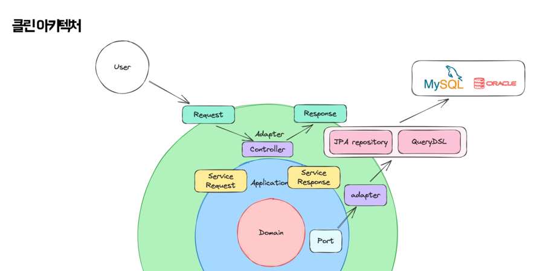
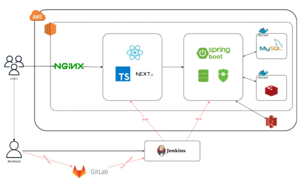

# 아끼미
> 불필요한 지출을 아끼고 원하는 물품을 구매하세요!


## 앱 설명
- 사용자의 불필요한 지출을 줄이고 원하는 물품을 구매할 수 있도록 돕는 애플리케이션

## 핵심 기능
- 간편 비밀번호(무작위 재배치)를 통한 보안
- 구매하길 원하는 물품을 등록하고, 기간 내로 돈을 모아 물품을 구매할 수 있도록 하는 챌린지 기능
- 다른 유저들과 하루의 아낀 기록을 공유하는 피드 기능
- 피드 작성 시 본인의 통장에서 돈이 같이 인출되고, 인출기록이 같이 관리되는 통장 관리 기능

## 화면


# 백엔드
## Software architecture

## 클린아키텍처를 적용한 이유

- 의존성 방향을 결정하여 변경 여파를 줄이고자
  - 상위레이어의 변경 사항이 하위 레이어에 영향을 미치지 않으므로 테스트코드, 소스코드의 유지보수에 도움이 됩니다.

**저희는 클린 아키텍처의 구조를 어떻게 프로젝트에 맞춰 변경할지 고민하였으며 결정을 위해 가져간 논리는 다음과 같습니다.**
## 1. Usecase를 사용하지 않기로 결정했습니다.
- 이유
    - Adapter에서 Application으로의 접근은 이미 의존성 방향이 정확하게 결정되어 있습니다.
    - Adapter layer의 보호와 사고의 분리라는 관점은 괜찮지만, 그럼에도 불구하고 하나의 구현체로 존재할 Service에 대해 
  인터페이스로 나누는 것은 너무 과하다는 의견이 있었습니다.

## 2. Port를 Command Query로 나눔
### 처음 고민했던 구조
1. port를 `CRUD` 로 모두 나누는 것
    ```java
    
    public interface UserCreatePort {
        void save(User user);
    }
    ```
    ```java
    public interface UserFindPort {
        void byId(Long id);
    }
    
    ```
    - 장점
        - CRUD로 모두 나눠 class에서 메서드의 목적 자체를 명시합니다.
        - 얇은 인터페이스는 구현해야할 요소가 적기때문에 갈아끼우기가 쉽습니다.
    - 단점
        - Port 분리가 많아져 코드 복잡도가 올라갈 수 있습니다.

2. domain 자체로 구분하는 것
    ```java
    public interface UserPort {
    	//crud ...
    }
    ```
    - 장점
        - Port의 개수를 매우 가볍게 가져갈 수 있습니다.
            - 오히려 가독성에 좋을 수 있습니다.
        - 초기 개발속도가 매우 빠릅니다.
    - 단점
        - CRUD가 모두 몰려 있어 넓은 port가 됩니다.
        - Adapter 교체 시 CRUD 목적성에 따라 나눌 수가 없습니다.

### Command Query로 분리한 이유
- `Transactional` 의 최적화에 있어 `Command` 가 존재하는지 확인하기만 하면 되므로 가독성 측면에서 유리해집니다.
- `read` 관련된 쿼리 작업이 대부분이기에 Port 하나의 부피만 과하게 커지는 것을 방지합니다.
- Command Query 분리를 시킴으로서 UseCase 내부 코드에서 목적성을 명확하게 판단합니다.
    - CQRS

## 3. 도메인 엔티티와 JPA 영속성 엔티티를 분리하지 않았습니다.
### 두가지를 구분했을 때의 장점
- 영속성 관련 로직이 구분됩니다.
    - NoSQL, RDBMS와 같이 DB의 목적 자체가 달라 구성을 다르게 해야하는 경우에도 도메인 로직에는 영향이 없어집니다.

### 단점
- 코드 양이 엄청나게 증가합니다.
  - 오히려 부피가 작고, RDBMS 이외의 다른 것들을 사용하는 경우엔 쓸 필요가 없어집니다.

**결론**
> 저희는 RDBMS만 사용하며, 도메인 규격 자체가 크지 않아 과한 설계라고 생각해 제외했습니다.

## Infra architecture



| 이름                                    | 개발 분야  | 담당 파트                           | 기타 역할       |
|---------------------------------------| ---------- |---------------------------------| --------------- |
| [김 솔](https://github.com/s01k1m)      | 프론트엔드 | 간편비밀번호(무작위 배열), 유저 인증, 유저 관련 기능 | 팀장            |
| [고서영](https://github.com/seoyoung81)  | 프론트엔드 | 피드, 영수증, 챌린지                    | 프론트엔드 리더 |
| [장윤아](https://github.com/zogak)       | 프론트엔드 | 챌린지                             |                 |
| [강병선](https://github.com/qudtjs0753)  | 백엔드     | 피드,영수증,리뷰(뷰 기능), 테스트환경 구성       | 백엔드 리더          |
| [조성찬](https://github.com/JoeSeongchan) | 백엔드     | 인증, 인프라                         | 인프라 리더    |
| [이승민](https://github.com/esm712)      | 백엔드     | 계좌, 유저, 물건조회                    |                 |

